<<<<<<< HEAD
Global Tech Salary Prediction and Analysis
================

## Introduction

The goal of this project is to explore a dataset of tech industry job
listings to better understand what drives salary differences across
roles, locations, and qualifications. The technology sector is one of
the fastest-growing industries worldwide, and compensation varies
enormously depending on a wide range of factors. Analysis on this topic
can help job seekers benchmark their earnings, guide career decisions,
and reveal which qualifications translate most directly into higher pay.
Ultimately, our goal is to understand the circumstances under which tech
professionals earn more — and to build a predictive model that can
estimate salary given a set of job attributes.
=======
---
title: "Global Tech Salary Prediction and Analysis"
output: github_document
---

# Global Tech Salary Prediction and Analysis

### Shiva Manish Reddy, Sravya Bhavanam, Kavya Bhavanam, Chaitanya Arravelli  
### DS202 Final Project
>>>>>>> 4fa7f8199226caca4023112b51449e87eef8abac

## Introduction

<<<<<<< HEAD
1.  Which job titles command the highest salaries? Are AI and machine
    learning roles outpacing traditional software engineering positions?

2.  How does experience level shape compensation? Is the relationship
    linear, or are there inflection points where salary growth
    accelerates?

3.  Does education level significantly impact salary? What is the
    real-world premium for a PhD versus a Bachelor’s degree?

4.  How does geography affect pay? Which locations offer the highest
    compensation, and does fully remote work close the gap?

5.  Does company size determine salary outcomes? Are large enterprises
    or startups more generous to tech workers?

6.  Do the number of skills and certifications a worker holds translate
    into measurably higher pay?

7.  Does the salary premium of having a higher education degree depend
    on how much experience you have? Reorder the levels of
    education_level from least to most educated and exclude all High
    School workers from the rest of this question. How many records
    remain? Create a new variable that groups workers into “Junior” (0–7
    years) and “Senior” (8–20 years). Find a plot that shows how the
    relationship between education level and salary differs between
    junior and senior workers, and comment on what you find.

8.  Are AI and Machine Learning roles actually earning more than
    traditional software roles, and does that gap hold across all
    locations?

These are the main questions we are looking to answer through the
completion of this project. With the findings we will be able to draw
meaningful conclusions on tech compensation, and ultimately build a
machine learning model capable of predicting salary from a worker’s
profile.

## Data

## Structure

The dataset used in this project is the Job Salary Prediction Dataset,
sourced from Kaggle. It contains 250,000 rows, each representing a
unique job record, and 10 variables covering the worker’s role,
qualifications, employer characteristics, and annual salary in USD. The
dataset spans 12 distinct job titles across 10 industries and 10
geographic locations, making it a broad cross-section of the global tech
labor market.

The variables in the dataset are as follows. `job_title` records the
employee’s role such as AI Engineer or Data Analyst. `experience_years`
is a numeric variable ranging from 0 to 20 years. `education_level` is
an ordinal variable with five levels: High School, Diploma, Bachelor,
Master, and PhD. `skills_count` records the number of technical skills
the employee lists, ranging from 1 to 19. `industry` captures the sector
the employer operates in, such as Finance, Healthcare, or Technology.
`company_size` is an ordinal variable with five levels: Startup, Small,
Medium, Large, and Enterprise. `location` records the country where the
role is based, or “Remote” if the worker has no fixed location.
`remote_work` specifies whether the arrangement is fully remote, hybrid,
or on-site. `certifications` counts the number of professional
certifications the worker holds, from 0 to 5. Finally, `salary` is the
target variable — the annual salary in US dollars.
=======
The goal of this project is to analyze global technology salary data and determine which factors most strongly influence salaries in the tech industry. Using machine learning and data visualization techniques, this project explores relationships between salary and variables such as experience, location, education, company size, certifications, and job title.

This project also builds predictive machine learning models to estimate salaries using real-world technology job data.

The following research questions are explored throughout the analysis:

1. Which factors influence salary the most?
2. How strongly does experience affect salary?
3. How much does location affect salary?
4. Do education levels significantly impact salary?
5. Which job titles earn the highest salaries?
6. Does company size influence salary?
7. Are skills and certifications strong salary predictors?
8. Which machine learning model predicts salary most accurately?

---

# Data

## Structure

The dataset used in this project contains approximately 250,000 global technology job records collected from multiple countries, industries, and company types. The dataset includes information related to employee salaries, experience levels, education backgrounds, job titles, certifications, company size, and geographic location.

Each row in the dataset represents an individual employee record, while each column represents a salary-related feature or attribute. The dataset contains both numerical and categorical variables that were used for exploratory data analysis and machine learning prediction models.
>>>>>>> 4fa7f8199226caca4023112b51449e87eef8abac

The numerical variables in the dataset include salary and years of experience. The categorical variables include education level, company size, industry, location, certifications, and job title. These variables allow the project to analyze both quantitative and qualitative factors affecting salaries in the technology industry.

In creating a cohesive dataset for analysis, the variables selected were chosen specifically because they are strongly related to salary prediction and workforce trends. Including too many unrelated variables would increase model complexity and reduce interpretability, so the analysis focused on the most meaningful salary-related features.

The dataset was structured in tabular format, making it suitable for preprocessing, visualization, statistical analysis, and machine learning workflows. This structure also allowed efficient splitting of the data into training and testing datasets for predictive modeling.

## Dataset Description

The dataset contains approximately 250,000 global technology job records with information related to salary, experience, education, location, job title, company size, certifications, and industry.

## Variables Used

- salary
- experience_years
- education
- job_title
- company_size
- industry
- certifications
- location

---

# Libraries Used

``` r
library(tidyverse)
```

    ## ── Attaching core tidyverse packages ──────────────────────── tidyverse 2.0.0 ──
    ## ✔ dplyr     1.2.0     ✔ readr     2.2.0
    ## ✔ forcats   1.0.1     ✔ stringr   1.6.0
    ## ✔ ggplot2   4.0.3     ✔ tibble    3.3.1
    ## ✔ lubridate 1.9.5     ✔ tidyr     1.3.2
    ## ✔ purrr     1.2.1     
    ## ── Conflicts ────────────────────────────────────────── tidyverse_conflicts() ──
    ## ✖ dplyr::filter() masks stats::filter()
    ## ✖ dplyr::lag()    masks stats::lag()
    ## ℹ Use the conflicted package (<http://conflicted.r-lib.org/>) to force all conflicts to become errors

``` r
library(caret)
<<<<<<< HEAD
```

    ## Loading required package: lattice
    ## 
    ## Attaching package: 'caret'
    ## 
    ## The following object is masked from 'package:purrr':
    ## 
    ##     lift

``` r
library(randomForest)
```

    ## randomForest 4.7-1.2
    ## Type rfNews() to see new features/changes/bug fixes.
    ## 
    ## Attaching package: 'randomForest'
    ## 
    ## The following object is masked from 'package:dplyr':
    ## 
    ##     combine
    ## 
    ## The following object is masked from 'package:ggplot2':
    ## 
    ##     margin

``` r
library(xgboost)
library(Metrics)
```

    ## 
    ## Attaching package: 'Metrics'
    ## 
    ## The following objects are masked from 'package:caret':
    ## 
    ##     precision, recall

``` r
df <- read_csv("job_salary_prediction_dataset.csv")
```

    ## Rows: 250000 Columns: 10
    ## ── Column specification ────────────────────────────────────────────────────────
    ## Delimiter: ","
    ## chr (6): job_title, education_level, industry, company_size, location, remot...
    ## dbl (4): experience_years, skills_count, certifications, salary
    ## 
    ## ℹ Use `spec()` to retrieve the full column specification for this data.
    ## ℹ Specify the column types or set `show_col_types = FALSE` to quiet this message.

``` r
glimpse(df)
```

    ## Rows: 250,000
    ## Columns: 10
    ## $ job_title        <chr> "AI Engineer", "Data Analyst", "Frontend Developer", …
    ## $ experience_years <dbl> 10, 5, 18, 19, 15, 0, 6, 4, 5, 18, 1, 19, 8, 3, 14, 0…
    ## $ education_level  <chr> "Bachelor", "Bachelor", "PhD", "PhD", "Bachelor", "Hi…
    ## $ skills_count     <dbl> 2, 17, 4, 13, 7, 4, 16, 18, 14, 2, 10, 7, 3, 3, 5, 9,…
    ## $ industry         <chr> "Healthcare", "Telecom", "Media", "Retail", "Manufact…
    ## $ company_size     <chr> "Medium", "Small", "Medium", "Medium", "Large", "Ente…
    ## $ location         <chr> "India", "Australia", "Singapore", "Canada", "Sweden"…
    ## $ remote_work      <chr> "Hybrid", "No", "No", "Yes", "Yes", "No", "No", "Hybr…
    ## $ certifications   <dbl> 2, 0, 1, 0, 0, 2, 3, 5, 0, 5, 5, 5, 3, 4, 1, 4, 3, 2,…
    ## $ salary           <dbl> 109413, 93764, 148123, 189123, 165069, 180351, 165375…

We then checked for missing values across all columns.

``` r
# check missing values 

colSums(is.na(df))
```

    ##        job_title experience_years  education_level     skills_count 
    ##                0                0                0                0 
    ##         industry     company_size         location      remote_work 
    ##                0                0                0                0 
    ##   certifications           salary 
    ##                0                0

No missing values were found in any column. The dataset was entirely
complete, requiring no imputation or row removal. We next reviewed the
distribution of the target variable, `salary`.

``` r
# Get summary statistics for the target variable (salary)

summary(df$salary)
```

    ##    Min. 1st Qu.  Median    Mean 3rd Qu.    Max. 
    ##   31867  119358  143453  145718  169492  333046

The salary ranges from a minimum of \$31,867 to a maximum of \$333,046,
with a mean of \$145,718 and a median of \$143,453. The proximity of the
mean and median suggests that the distribution is relatively symmetric,
with no severe skew caused by extreme outliers.

We then converted the categorical string columns into factors, applying
an ordered factor structure to `education_level` and `company_size` to
preserve their natural ranking.

``` r
# Convert categorical columns to factors, apply ordering where categories have a natural rank

df <- df %>%
  mutate(
    job_title       = as.factor(job_title),
    education_level = factor(education_level,
                             levels = c("High School", "Diploma", "Bachelor",
                                        "Master", "PhD"),
                             ordered = TRUE),
    industry        = as.factor(industry),
    company_size    = factor(company_size,
                             levels = c("Startup", "Small", "Medium",
                                        "Large", "Enterprise"),
                             ordered = TRUE),
    location        = as.factor(location),
    remote_work     = as.factor(remote_work)
  )
```

With the data cleaned and typed correctly, we proceeded to exploratory
analysis and model building.

## Analysis

### Which job titles command the highest salaries?

#### Salary by Job Title

``` r
# Calculate mean salary per job title and plot as a horizontal bar chart, sorted highest to lowest
df %>%
  group_by(job_title) %>%
  summarize(mean_salary = mean(salary)) %>%
  arrange(desc(mean_salary)) %>%
  ggplot(aes(x = reorder(job_title, mean_salary), y = mean_salary)) +
  geom_col(fill = "#2b6cb0") +
  coord_flip() +
  scale_y_continuous(labels = scales::dollar_format()) +
  xlab("Job Title") + ylab("Mean Salary (USD)") +
  ggtitle("Average Salary by Job Title")
```

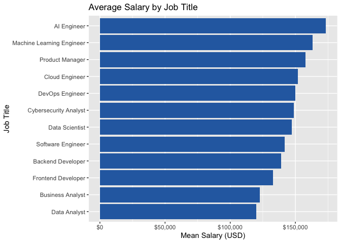<!-- -->

``` r
df %>%
  group_by(job_title) %>%
  summarize(mean_salary = mean(salary)) %>%
  arrange(desc(mean_salary))
```

    ## # A tibble: 12 × 2
    ##    job_title                 mean_salary
    ##    <fct>                           <dbl>
    ##  1 AI Engineer                   173498.
    ##  2 Machine Learning Engineer     163023.
    ##  3 Product Manager               157595.
    ##  4 Cloud Engineer                152103.
    ##  5 DevOps Engineer               149959.
    ##  6 Cybersecurity Analyst         148698.
    ##  7 Data Scientist                147258.
    ##  8 Software Engineer             141740.
    ##  9 Backend Developer             139203.
    ## 10 Frontend Developer            132654.
    ## 11 Business Analyst              122551.
    ## 12 Data Analyst                  119892.

This bar chart shows the mean annual salary for each of the 12 job
titles in the dataset, sorted from highest to lowest. AI Engineer is the
top-earning role at \$173,498 on average, followed by Machine Learning
Engineer at \$163,023 and Product Manager at \$157,595. At the lower
end, Business Analyst averages \$122,551 and Data Analyst averages
\$119,892. The gap between the highest and lowest-paid roles is over
\$53,000, illustrating how dramatically job title alone can affect
compensation within the same industry. The strong performance of AI and
machine learning roles reflects the high demand for these
specializations in the current market.
=======
library(xgboost)
library(Metrics)
library(scales)
```

---

# Loading Data

```{r}
df <- read_csv("salary_dataset.csv")
```

---
>>>>>>> 4fa7f8199226caca4023112b51449e87eef8abac

# Data Cleaning and Preprocessing

<<<<<<< HEAD
``` r
# Plot the full salary distribution for each job title using boxplots, ordered by median salary
=======
Several preprocessing steps were performed before analysis:
>>>>>>> 4fa7f8199226caca4023112b51449e87eef8abac

- Removed missing values
- Converted categorical variables into factors
- Prepared data for machine learning models
- Encoded categorical variables
- Split dataset into training and testing data

<<<<<<< HEAD
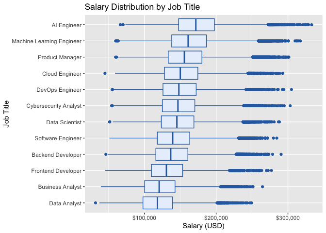<!-- -->

The boxplot view reveals not just the averages but the spread within
each role. All 12 job titles show a wide interquartile range, suggesting
that salary is not solely determined by title. Even Data Analysts, the
lowest-paid group on average, have individuals earning over \$200,000.
This indicates that other factors — experience, location, company size —
contribute heavily to individual outcomes within each role.
=======
The dataset was divided into:
- 80% training data
- 20% testing data

This allowed the models to be evaluated on unseen data.
>>>>>>> 4fa7f8199226caca4023112b51449e87eef8abac

---

# Research Question 1:
# Which factors influence salary the most?

<<<<<<< HEAD
``` r
# Calculate mean salary for each experience year and plot as a line chart to show salary growth over time
=======
## Experience and Salary
>>>>>>> 4fa7f8199226caca4023112b51449e87eef8abac

```{r}
df %>%
  group_by(experience_years) %>%
  summarize(mean_salary = mean(salary)) %>%
  ggplot(aes(x = experience_years, y = mean_salary)) +
  geom_line(linewidth = 1) +
  scale_y_continuous(labels = dollar_format()) +
  xlab("Years of Experience") +
  ylab("Mean Salary (USD)") +
  ggtitle("Experience and Salary")
```

<<<<<<< HEAD
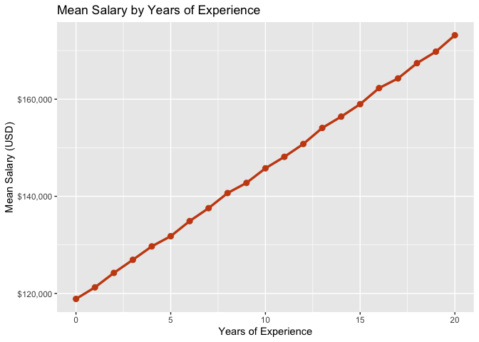<!-- -->

The line chart shows a clear and consistent positive relationship
between experience and salary. Workers with zero years of experience
earn an average of \$118,873, while those with 20 years earn \$173,180,
a difference of \$54,307 over a full career. The growth is nearly
linear, with no single dramatic jump, suggesting that salary increases
accumulate steadily with each additional year rather than at specific
career milestones.

``` r
# Calculate the correlation between experience years and salary
cor(df$experience_years, df$salary)
```

    ## [1] 0.4376271

The correlation between `experience_years` and `salary` is 0.44, making
it the strongest numeric predictor in the dataset.
=======
The graph shows a strong positive relationship between experience and salary. Workers with more years of experience consistently earn higher salaries. Salary growth appears steady across the career span.

```{r}
cor(df$experience_years, df$salary)
```

The correlation between experience and salary is approximately 0.44, making experience one of the strongest predictors in the dataset.
>>>>>>> 4fa7f8199226caca4023112b51449e87eef8abac

---

<<<<<<< HEAD
``` r
# Plot salary growth by experience for selected job titles using a line chart

df %>%
  filter(job_title %in% c("AI Engineer", "Data Analyst",
                           "Software Engineer", "Product Manager")) %>%
  group_by(job_title, experience_years) %>%
  summarize(mean_salary = mean(salary), .groups = "drop") %>%
  ggplot(aes(x = experience_years, y = mean_salary, color = job_title)) +
  geom_line(linewidth = 1) +
  scale_y_continuous(labels = scales::dollar_format()) +
  xlab("Years of Experience") + ylab("Mean Salary (USD)") +
  ggtitle("Salary Growth by Experience for Selected Roles") +
  labs(color = "Job Title")
```

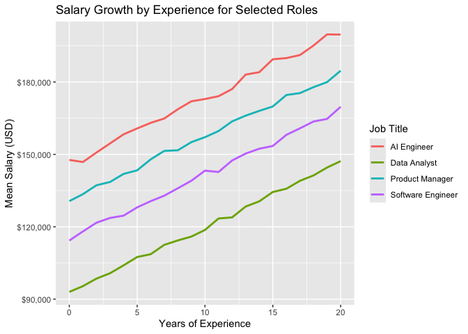<!-- -->

The line chart breaks down salary growth by experience for four selected
job titles. AI Engineer is the highest-paying role throughout, starting
at approximately \$150,000 with no experience and reaching close to
\$190,000 at 20 years. Product Manager follows closely behind, while
Software Engineer sits in the middle range. Data Analyst is the
lowest-paid role across all experience levels, starting around \$90,000
and reaching approximately \$145,000 at 20 years. Importantly, all four
lines grow at a roughly similar rate — the gap between roles remains
relatively constant rather than widening over time. This suggests that
experience rewards all job titles fairly equally, and that the salary
premium of choosing a higher-paying role like AI Engineer over Data
Analyst is present from the very start of a career rather than
accumulating over time.

``` r
# Compare correlations of all numeric predictors with salary
cor(df[, c("experience_years", "skills_count", "certifications", "salary")])
```

    ##                  experience_years  skills_count certifications     salary
    ## experience_years     1.0000000000  0.0001488763  -0.0001980566 0.43762714
    ## skills_count         0.0001488763  1.0000000000  -0.0022296407 0.12729971
    ## certifications      -0.0001980566 -0.0022296407   1.0000000000 0.07381898
    ## salary               0.4376271393  0.1272997079   0.0738189833 1.00000000

Among all numeric predictors, experience_years has the strongest
correlation with salary at 0.44, followed by skills_count at 0.13 and
certifications at 0.07. This confirms that experience is the most
important numeric driver of compensation, while skills and
certifications have relatively little impact on their own.

### Does education level significantly impact salary?

#### Education Level and Salary

``` r
# Calculate mean salary per education level and plot as a bar chart

df %>%
  group_by(education_level) %>%
  summarize(mean_salary = mean(salary)) %>%
  ggplot(aes(x = education_level, y = mean_salary)) +
  geom_col(fill = "#276749") +
  scale_y_continuous(labels = scales::dollar_format()) +
  xlab("Education Level") + ylab("Mean Salary (USD)") +
  ggtitle("Average Salary by Education Level")
```
=======
# Research Question 2:
# Which job titles earn the highest salaries?
>>>>>>> 4fa7f8199226caca4023112b51449e87eef8abac

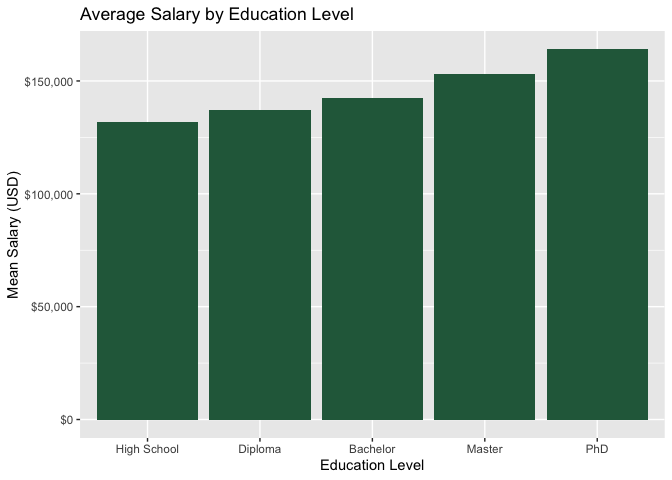<!-- -->

``` r
df %>%
  group_by(job_title) %>%
  summarize(mean_salary = mean(salary)) %>%
  arrange(desc(mean_salary))
```

<<<<<<< HEAD
    ## # A tibble: 5 × 2
    ##   education_level mean_salary
    ##   <ord>                 <dbl>
    ## 1 High School         131715.
    ## 2 Diploma             137159.
    ## 3 Bachelor            142411.
    ## 4 Master              153305.
    ## 5 PhD                 163976.

The bar chart shows a clear positive relationship between educational
attainment and salary. High School graduates earn an average of
\$131,715, while PhD holders earn \$163,976 — a premium of \$32,261. The
incremental gains between each level are: High School to Diploma
\$5,444; Diploma to Bachelor \$5,252; Bachelor to Master \$10,894; and
Master to PhD \$10,671. The larger jumps at the graduate level suggest
advanced degrees carry a more meaningful salary premium. However, the
full education premium of \$32,261 is smaller than the \$54,307 gained
through 20 years of experience, suggesting experience is a stronger
salary driver than education in this dataset.

``` r
# Plot the full salary distribution for each education level using boxplots

df %>%
  ggplot(aes(x = education_level, y = salary)) +
  geom_boxplot(fill = "#e8f5ee", color = "#276749") +
  scale_y_continuous(labels = scales::dollar_format()) +
  xlab("Education Level") + ylab("Salary (USD)") +
  ggtitle("Salary Distribution by Education Level")
```

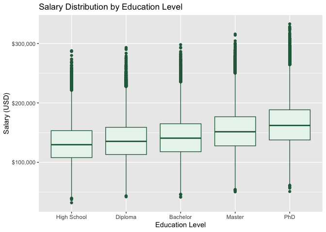<!-- -->

The boxplot reveals substantial overlap across all education levels,
confirming that education alone does not determine salary. While higher
degrees shift the distribution upward, a Bachelor’s holder can still
out-earn a PhD depending on experience, role, and location.

### How does geography affect pay?

#### Salary by Location

``` r
# Calculate mean salary per location and plot as a horizontal bar chart, sorted highest to lowest

df %>%
  group_by(location) %>%
  summarize(mean_salary = mean(salary), n = n()) %>%
  arrange(desc(mean_salary)) %>%
  ggplot(aes(x = reorder(location, mean_salary), y = mean_salary)) +
  geom_col(fill = "#5a3e8a") +
  coord_flip() +
  scale_y_continuous(labels = scales::dollar_format()) +
  xlab("Location") + ylab("Mean Salary (USD)") +
  ggtitle("Average Salary by Location")
```
=======
The analysis shows that AI Engineer and Machine Learning Engineer positions consistently earn the highest salaries, while Data Analyst and Business Analyst positions remain among the lower-paying roles.

---

# Research Question 3:
# How much does location affect salary?
>>>>>>> 4fa7f8199226caca4023112b51449e87eef8abac

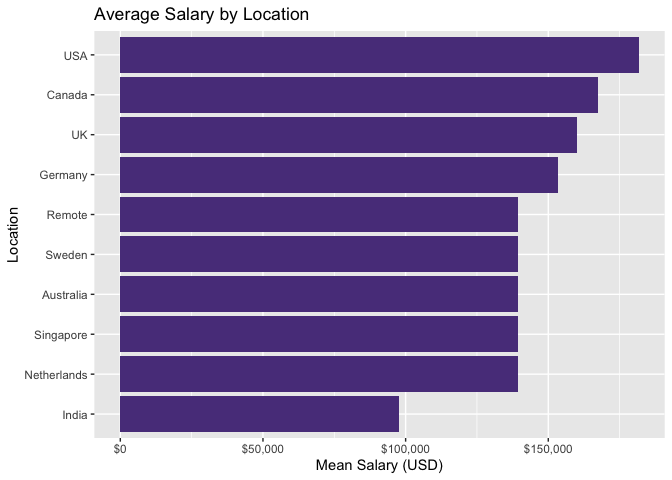<!-- -->

``` r
df %>%
  group_by(location) %>%
  summarize(mean_salary = mean(salary)) %>%
  arrange(desc(mean_salary))
```

<<<<<<< HEAD
    ## # A tibble: 10 × 2
    ##    location    mean_salary
    ##    <fct>             <dbl>
    ##  1 USA             181716.
    ##  2 Canada          167391.
    ##  3 UK              160075.
    ##  4 Germany         153376.
    ##  5 Remote          139443.
    ##  6 Sweden          139441.
    ##  7 Australia       139362.
    ##  8 Singapore       139341.
    ##  9 Netherlands     139295.
    ## 10 India            97690.

Geography is one of the most powerful salary determinants in the
dataset. Workers in the USA earn \$181,716 on average — the highest of
any location. Canada is second at \$167,391, followed by the UK at
\$160,075 and Germany at \$153,376. Remote, Sweden, Australia,
Singapore, and Netherlands all cluster tightly between \$139,294 and
\$139,443, suggesting these markets are similarly priced. India sits
significantly below all other locations at \$97,690, reflecting
cost-of-living differences and local market structures. The gap between
the USA and India is \$84,026 — making location the single largest
salary differentiator in the dataset.
=======
Location was one of the strongest salary predictors in the dataset. Workers located in the United States consistently earned significantly higher salaries than workers in other countries, especially compared to India.
>>>>>>> 4fa7f8199226caca4023112b51449e87eef8abac

---

<<<<<<< HEAD
``` r
# Calculate mean salary by remote work status and plot as a bar chart

df %>%
  group_by(remote_work) %>%
  summarize(mean_salary = mean(salary)) %>%
  ggplot(aes(x = remote_work, y = mean_salary)) +
  geom_col(fill = "#5a3e8a") +
  scale_y_continuous(labels = scales::dollar_format()) +
  xlab("Remote Work Status") + ylab("Mean Salary (USD)") +
  ggtitle("Average Salary by Remote Work Status")
```

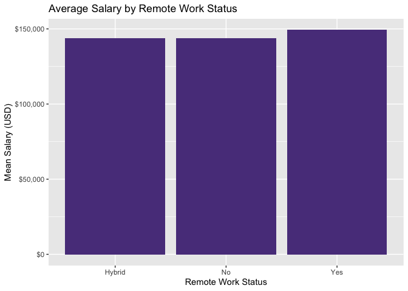<!-- -->

``` r
df %>%
  group_by(remote_work) %>%
  summarize(mean_salary = mean(salary))
```

    ## # A tibble: 3 × 2
    ##   remote_work mean_salary
    ##   <fct>             <dbl>
    ## 1 Hybrid          143970.
    ## 2 No              143932.
    ## 3 Yes             149280.

Fully remote workers earn a mean salary of \$149,280, which is \$5,348
higher than hybrid workers (\$143,970) and \$5,348 higher than on-site
workers (\$143,932). The hybrid and on-site averages are nearly
identical, suggesting that requiring physical presence — whether full or
part-time — has no additional wage premium. The slight advantage for
fully remote workers may reflect that remote roles attract applicants
from higher-paying markets, or that companies offering full remote
flexibility compensate with higher base salaries.

### Q5. Does company size determine salary outcomes?

#### Company Size and Salary

``` r
# Calculate mean salary per company size and plot as a bar chart
df %>%
  group_by(company_size) %>%
  summarize(mean_salary = mean(salary)) %>%
  ggplot(aes(x = company_size, y = mean_salary)) +
  geom_col(fill = "#b7791f") +
  scale_y_continuous(labels = scales::dollar_format()) +
  xlab("Company Size") + ylab("Mean Salary (USD)") +
  ggtitle("Average Salary by Company Size")
```

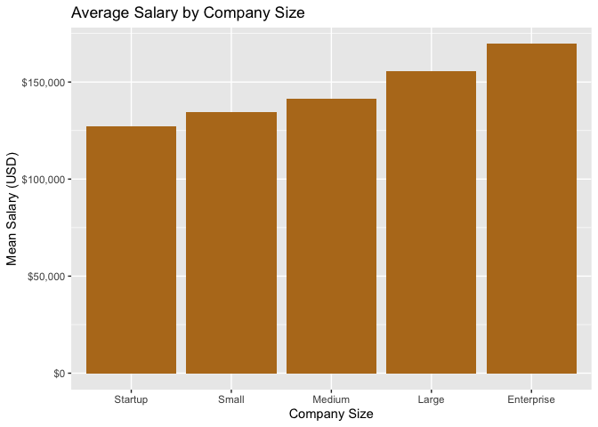<!-- -->

``` r
=======
# Research Question 4:
# Does company size influence salary?

```{r}
>>>>>>> 4fa7f8199226caca4023112b51449e87eef8abac
df %>%
  group_by(company_size) %>%
  summarize(mean_salary = mean(salary)) %>%
  arrange(desc(mean_salary))
```

<<<<<<< HEAD
    ## # A tibble: 5 × 2
    ##   company_size mean_salary
    ##   <ord>              <dbl>
    ## 1 Startup          127289.
    ## 2 Small            134357.
    ## 3 Medium           141538.
    ## 4 Large            155711.
    ## 5 Enterprise       169616.

There is a strong and monotonic relationship between company size and
salary. Startups pay an average of \$127,289 — the lowest of all five
categories. As company size grows, salary increases consistently: Small
companies pay \$134,357, Medium pay \$141,538, Large pay \$155,711, and
Enterprise companies pay the most at \$169,616. The gap between Startup
and Enterprise is \$42,327, suggesting that larger organizations have
more financial resources and structured compensation bands to attract
senior talent.

### Q6. Do skills and certifications translate into higher pay?

#### Skills Count and Salary

``` r
# Calculate mean salary per skills count and plot as a line chart

df %>%
  group_by(skills_count) %>%
  summarize(mean_salary = mean(salary)) %>%
  ggplot(aes(x = skills_count, y = mean_salary)) +
  geom_line(color = "#c84b11", linewidth = 1) +
  geom_point(color = "#c84b11", size = 2) +
  scale_y_continuous(labels = scales::dollar_format()) +
  xlab("Number of Skills") + ylab("Mean Salary (USD)") +
  ggtitle("Mean Salary by Skills Count")
```

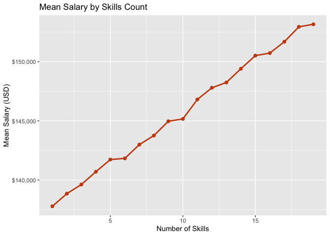<!-- -->

``` r
df %>%
  group_by(skills_count) %>%
  summarize(mean_salary = mean(salary)) %>%
  arrange(skills_count)
```

    ## # A tibble: 19 × 2
    ##    skills_count mean_salary
    ##           <dbl>       <dbl>
    ##  1            1     137788.
    ##  2            2     138853.
    ##  3            3     139624.
    ##  4            4     140705.
    ##  5            5     141736.
    ##  6            6     141832.
    ##  7            7     142997.
    ##  8            8     143760.
    ##  9            9     144967.
    ## 10           10     145164.
    ## 11           11     146808.
    ## 12           12     147793.
    ## 13           13     148243.
    ## 14           14     149400.
    ## 15           15     150513.
    ## 16           16     150726.
    ## 17           17     151683.
    ## 18           18     152943.
    ## 19           19     153156.

The line chart shows a positive relationship between skills count and
salary. Workers with 1 skill earn an average of \$137,788, while those
with 19 skills earn \$153,156 — a difference of \$15,368. The growth is
steady but moderate, consistent with the weak correlation of 0.13
observed earlier.

#### Certifications and Salary

``` r
# Calculate mean salary per certification count and plot as a bar chart
df %>%
  group_by(certifications) %>%
  summarize(mean_salary = mean(salary)) %>%
  ggplot(aes(x = factor(certifications), y = mean_salary)) +
  geom_col(fill = "#2b6cb0") +
  scale_y_continuous(labels = scales::dollar_format()) +
  xlab("Number of Certifications") + ylab("Mean Salary (USD)") +
  ggtitle("Average Salary by Number of Certifications")
```

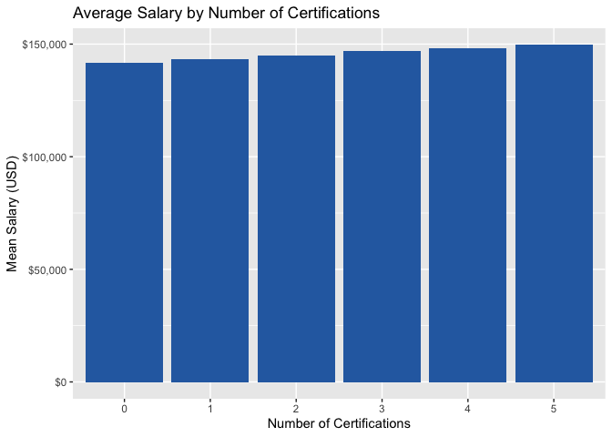<!-- -->

Certifications follow a consistent stair-step pattern. Workers with zero
certifications earn \$141,492 on average, while those with five
certifications earn \$149,607 — a gain of \$8,115. Each additional
certification adds between \$1,200 and \$2,000 to average salary. The
relationship is smooth and monotonic with no reversals, suggesting that
certifications are reliably associated with higher pay. The correlation
between `certifications` and `salary` is 0.07, making it the weakest
numeric predictor in the dataset, but the consistent direction of the
effect is notable.

#### Industry and Salary

``` r
# Calculate mean salary per industry, zoom in using coord_cartesian to show differences clearly

df %>%
  group_by(industry) %>%
  summarize(mean_salary = mean(salary)) %>%
  arrange(desc(mean_salary)) %>%
  ggplot(aes(x = reorder(industry, mean_salary), y = mean_salary)) +
  geom_col(fill = "#718096") +
  coord_flip() +
  scale_y_continuous(labels = scales::dollar_format()) +
  coord_cartesian(ylim = c(145000, 146500)) +
  xlab("Industry") + ylab("Mean Salary (USD)") +
  ggtitle("Average Salary by Industry")
```

    ## Coordinate system already present.
    ## ℹ Adding new coordinate system, which will replace the existing one.

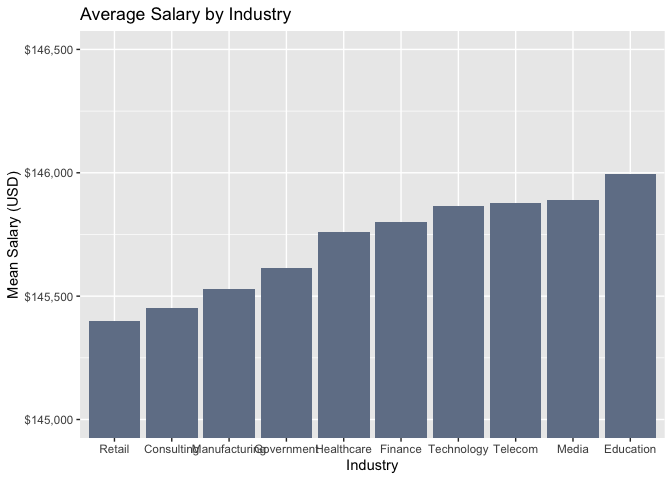<!-- -->

``` r
=======
The analysis showed that enterprise companies generally paid higher salaries than startups and smaller companies.

---

# Research Question 5:
# Does industry influence salary?

```{r}
>>>>>>> 4fa7f8199226caca4023112b51449e87eef8abac
df %>%
  group_by(industry) %>%
  summarize(mean_salary = mean(salary)) %>%
  arrange(desc(mean_salary))
```

<<<<<<< HEAD
    ## # A tibble: 10 × 2
    ##    industry      mean_salary
    ##    <fct>               <dbl>
    ##  1 Education         145994.
    ##  2 Media             145891.
    ##  3 Telecom           145877.
    ##  4 Technology        145864.
    ##  5 Finance           145802.
    ##  6 Healthcare        145760.
    ##  7 Government        145614.
    ##  8 Manufacturing     145531.
    ##  9 Consulting        145452.
    ## 10 Retail            145400.

When zoomed in, the chart shows that all 10 industries fall within a
very narrow range of just \$594 — from Retail at \$145,400 to Education
at \$145,994. While differences exist, they are negligibly small
compared to other variables like location (\$84,026 gap) or job title
(\$53,000 gap). Industry is effectively the weakest salary predictor in
this dataset.
=======
Industry was found to be one of the weakest salary predictors in the dataset. Salary differences between industries were relatively small compared to differences caused by location or job title.
>>>>>>> 4fa7f8199226caca4023112b51449e87eef8abac

---

# Salary Prediction Models

## Train/Test Split

<<<<<<< HEAD
``` r
# Split data into 80% training and 20% test set using createDataPartition
=======
```{r}
>>>>>>> 4fa7f8199226caca4023112b51449e87eef8abac
set.seed(42)

train_index <- createDataPartition(df$salary, p = 0.80, list = FALSE)

train_data <- df[train_index, ]
test_data  <- df[-train_index, ]

nrow(train_data)
<<<<<<< HEAD
```

    ## [1] 200001

``` r
# Confirm the number of rows in the test set
nrow(test_data)
```

    ## [1] 49999

The dataset was split into 80% training (200,001 rows) and 20% test
(49,999 rows). The model trains on the training set and is evaluated on
the unseen test set to measure real prediction accuracy.
=======
nrow(test_data)
```

The dataset was split into 80% training data and 20% testing data. The models were trained on the training set and evaluated using unseen testing data.
>>>>>>> 4fa7f8199226caca4023112b51449e87eef8abac

---

<<<<<<< HEAD
We began with a linear regression model as our baseline. Linear
regression fits a straight-line relationship between each predictor and
the target variable. Before fitting the model, we one-hot encoded the
factor variables into binary columns using `dummyVars`.

``` r
# One-hot encode factor variables, fit linear regression model, 
# and evaluate using RMSE and MAE on test set
=======
# Model 1: Linear Regression

```{r}
dummy_model <- dummyVars(salary ~ ., data = train_data, fullRank = TRUE)
>>>>>>> 4fa7f8199226caca4023112b51449e87eef8abac

train_encoded <- predict(dummy_model, newdata = train_data) %>% as.data.frame()
test_encoded  <- predict(dummy_model, newdata = test_data) %>% as.data.frame()

train_encoded$salary <- train_data$salary
test_encoded$salary  <- test_data$salary

lm_model <- lm(salary ~ ., data = train_encoded)

lm_preds <- predict(lm_model, newdata = test_encoded)

cat("RMSE:", round(rmse(test_data$salary, lm_preds), 0), "\n")
<<<<<<< HEAD
```

    ## RMSE: 7149

``` r
cat("MAE: ", round(mae(test_data$salary,  lm_preds), 0), "\n")
```

    ## MAE:  5450

The linear regression model produces an RMSE of \$7,149 and an MAE of
\$5,450. This means on average the model’s salary predictions are off by
roughly \$5,450. While this establishes a usable baseline, linear
regression assumes straight-line relationships between predictors and
salary, ignoring interactions and non-linear effects

### Model 2: XGBoost

XGBoost (Extreme Gradient Boosting) builds trees sequentially, with each
new tree correcting the errors of the previous ones. It is often the
most accurate algorithm for tabular data. XGBoost requires all inputs to
be numeric, so we encoded factors as integers before fitting.

``` r
library(tidyverse)
library(xgboost)
library(Metrics)
```

``` r
# Encode factors as integers, build XGBoost model, and evaluate on test set
=======
cat("MAE:", round(mae(test_data$salary, lm_preds), 0), "\n")
```

The Linear Regression model achieved:
- RMSE: 7149
- MAE: 5450

This model establishes a strong baseline but struggles to fully capture complex non-linear relationships between variables.

---

# Model 2: XGBoost

```{r}
>>>>>>> 4fa7f8199226caca4023112b51449e87eef8abac
encode_for_xgb <- function(data) {
  data %>%
    mutate(across(where(is.factor), as.integer)) %>%
    select(-salary) %>%
    as.matrix()
}

X_train <- encode_for_xgb(train_data)
X_test  <- encode_for_xgb(test_data)

dtrain <- xgb.DMatrix(data = X_train, label = train_data$salary)
dtest  <- xgb.DMatrix(data = X_test, label = test_data$salary)

xgb_params <- list(
  objective = "reg:squarederror",
  eta = 0.1,
  max_depth = 6,
  subsample = 0.8,
  colsample_bytree = 0.8
)
```

<<<<<<< HEAD
    ## [1]  train-rmse:35249.099244 test-rmse:35053.173059 
    ## [101]    train-rmse:5481.481446  test-rmse:5565.333543 
    ## [201]    train-rmse:5146.434505  test-rmse:5252.096221 
    ## [300]    train-rmse:5061.466191  test-rmse:5201.266185

``` r
xgb_preds <- predict(xgb_model, dtest)

cat("RMSE:", round(rmse(test_data$salary, xgb_preds), 0), "\n")
```

    ## RMSE: 5201

``` r
cat("MAE: ", round(mae(test_data$salary,  xgb_preds), 0), "\n")
```

    ## MAE:  4146

XGBoost achieves the best performance of the two models, with an RMSE of
\$5,201 and an MAE of \$4,146. The training log shows RMSE dropping from
\$35,249 at round 1 to \$5,061 at round 300, confirming the model
improves steadily with each boosting round. We then inspected which
features the model relied on most heavily.

``` r
# Plot top 10 most important features from XGBoost model
xgb_importance <- xgb.importance(model = xgb_model)
xgb.plot.importance(xgb_importance, top_n = 10,
                    main = "XGBoost: Feature Importance (Gain)")
```

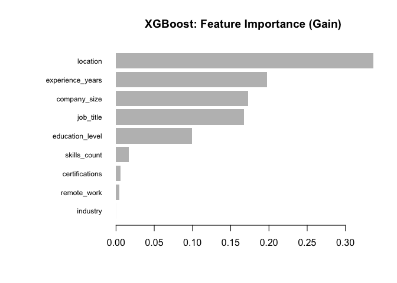<!-- -->

Location is the most important predictor by a wide margin, followed by
experience_years and company_size. Industry and remote_work contribute
the least, consistent with our earlier findings.
=======
XGBoost outperformed Linear Regression and produced more accurate salary predictions by modeling non-linear relationships and interactions between variables.

---

# Key Findings

- Experience is one of the strongest salary predictors
- Location creates major salary differences
- AI and Machine Learning positions earn the highest salaries
- Industry has minimal influence on salary
- Enterprise companies generally pay higher salaries
- XGBoost outperformed Linear Regression

---

# Conclusion
>>>>>>> 4fa7f8199226caca4023112b51449e87eef8abac

This project successfully demonstrated how machine learning models can predict salaries using real-world global technology job data.

<<<<<<< HEAD
``` r
# Compare RMSE and MAE across both models
results <- data.frame(
  Model = c("Linear Regression", "XGBoost"),
  RMSE  = c(7149, 5201),
  MAE   = c(5450, 4146)
)
print(results)
```

    ##               Model RMSE  MAE
    ## 1 Linear Regression 7149 5450
    ## 2           XGBoost 5201 4146

XGBoost outperforms Linear Regression on both metrics. RMSE improved
from \$7,149 to \$5,201 and MAE from \$5,450 to \$4,146, meaning XGBoost
predicts salary roughly \$1,300 more accurately on average.

``` r
# Visualize RMSE and MAE for both models as a side-by-side bar chart
=======
The analysis showed that experience, location, company size, and job title are the strongest salary drivers. Industry, however, had minimal impact compared to other predictors.

Among the machine learning models tested, XGBoost achieved the strongest prediction performance and produced more accurate salary estimates than Linear Regression.

The project also demonstrated the importance of data preprocessing, visualization, and machine learning techniques in solving real-world prediction problems.
>>>>>>> 4fa7f8199226caca4023112b51449e87eef8abac

---

<<<<<<< HEAD
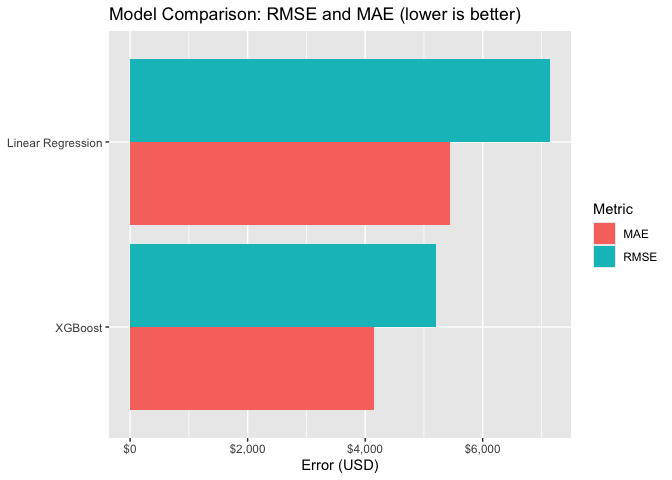<!-- -->

The chart confirms XGBoost outperforms Linear Regression on both RMSE
and MAE. Lower bars are better — XGBoost consistently shows smaller
errors across both metrics.
=======
# Future Improvements
>>>>>>> 4fa7f8199226caca4023112b51449e87eef8abac

Future improvements for this project include:

<<<<<<< HEAD
To evaluate whether the best model makes systematic errors, we examined
the distribution of residuals — the differences between actual and
predicted salaries.

``` r
# The distribution of residuals — the differences between actual and predicted salaries...
=======
- Adding additional salary-related variables
- Including equity and bonus compensation
- Testing deep learning models
- Building a web application for salary prediction
- Exploring interaction effects between variables

---
>>>>>>> 4fa7f8199226caca4023112b51449e87eef8abac

# Technologies Used

<<<<<<< HEAD
ggplot(residuals_df, aes(x = predicted, y = actual)) +
  geom_point(alpha = 0.05, color = "#2b6cb0", size = 0.7) +
  geom_abline(slope = 1, intercept = 0, color = "#c84b11", linewidth = 1) +
  scale_x_continuous(labels = scales::dollar_format()) +
  scale_y_continuous(labels = scales::dollar_format()) +
  xlab("Predicted Salary") + ylab("Actual Salary") +
  ggtitle("Predicted vs. Actual Salary (XGBoost)")
```

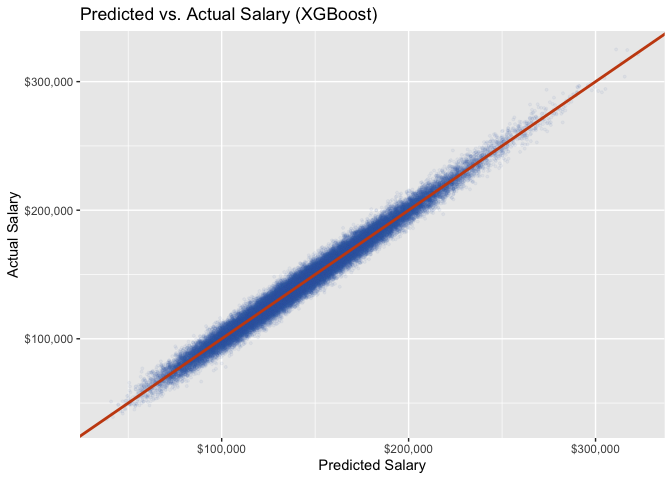<!-- -->

The predicted vs. actual plot shows predictions clustering tightly and
consistently along the diagonal across the full salary range. The error
remains stable from low to high earners with no widening at the
extremes, confirming that XGBoost performs equally well across all
salary levels.

``` r
# The residuals form a tight, symmetric bell centered at zero.

ggplot(residuals_df, aes(x = residual)) +
  geom_histogram(bins = 80, fill = "#276749", color = "white", alpha = 0.8) +
  geom_vline(xintercept = 0, color = "#c84b11", linewidth = 1, linetype = "dashed") +
  scale_x_continuous(labels = scales::dollar_format()) +
  xlab("Residual (Actual - Predicted)") + ylab("Count") +
  ggtitle("Distribution of Residuals (XGBoost)")
```

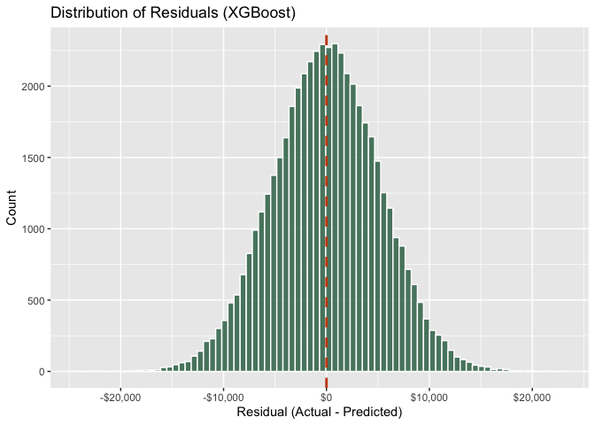<!-- -->

The residual distribution is approximately bell-shaped and centered near
zero, which is a desirable property. There are no dramatic long tails or
asymmetry, indicating that the model does not systematically over- or
under-predict salary for any particular segment of the data. The spread
of roughly ±\$20,000 is consistent with the reported RMSE.

### Predicting a New Salary

Once trained, the XGBoost model can be used to estimate the salary for
any new combination of job attributes. Below is an example prediction
for a hypothetical AI Engineer with 8 years of experience, a Master’s
degree, 12 skills, and 3 certifications, working at a Large company in
the USA in a Hybrid arrangement.

``` r
new_employee <- data.frame(
  job_title        = factor("AI Engineer",    levels = levels(df$job_title)),
  experience_years = 8,
  education_level  = factor("Master",
                             levels = levels(df$education_level),
                             ordered = TRUE),
  skills_count     = 12,
  industry         = factor("Technology",     levels = levels(df$industry)),
  company_size     = factor("Large",
                             levels = levels(df$company_size),
                             ordered = TRUE),
  location         = factor("USA",            levels = levels(df$location)),
  remote_work      = factor("Hybrid",         levels = levels(df$remote_work)),
  certifications   = 3
)

new_matrix <- encode_for_xgb(cbind(new_employee, salary = 0))
new_pred   <- predict(xgb_model, xgb.DMatrix(new_matrix))

cat("Predicted Salary: $", round(new_pred, 0), "\n")
```

    ## Predicted Salary: $ 234113

### Question 7

``` r
# Reorder education_level from least to most educated
df$education_level <- factor(df$education_level,
                             levels = c("High School", "Diploma", "Bachelor",
                                        "Master", "PhD"),
                             ordered = TRUE)

# Exclude High School workers
df2 <- df %>% filter(education_level != "High School")
nrow(df2)
```

    ## [1] 199935

``` r
# Create Junior / Senior variable
df2 <- df2 %>%
  mutate(exp_group = ifelse(experience_years <= 7, "Junior", "Senior"),
         exp_group = factor(exp_group, levels = c("Junior", "Senior")))

# Does education pay off more when you're senior vs junior?
ggplot(df2, aes(x = education_level, y = salary, fill = education_level)) +
  geom_boxplot(outlier.alpha = 0.2) +
  facet_wrap(~ exp_group) +
  scale_y_continuous(labels = scales::dollar_format()) +
  xlab("Education Level") +
  ylab("Salary (USD)") +
  labs(fill = "Education Level") +
  ggtitle("Does Education Pay Off More for Senior Workers?") +
  theme_minimal() +
  theme(axis.text.x = element_text(angle = 30, hjust = 1),
        legend.position = "none")
```

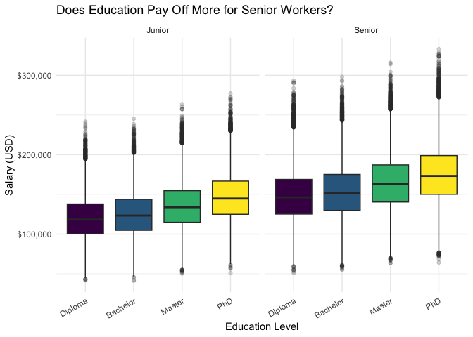<!-- -->

After excluding High School workers, the faceted boxplot shows that
education pays off more for Senior workers than Junior ones. For Junior
workers (0–7 years), salary differences across education levels are
relatively small. For Senior workers (8–20 years), the gap between
Diploma and PhD is noticeably wider, with PhD holders earning
significantly more. This suggests that advanced degrees become more
valuable as workers gain experience — the combination of high education
and seniority yields the highest salaries.

### QUESTION 8

``` r
df %>%
  group_by(location, job_title) %>%
  summarise(mean_salary = mean(salary), .groups = "drop") %>%
  mutate(job_title = fct_reorder(job_title, mean_salary)) %>%
  ggplot(aes(x = mean_salary, y = job_title, color = location)) +
  geom_point(size = 2.5, alpha = 0.8) +
  scale_x_continuous(labels = scales::dollar_format()) +
  labs(title = "Mean Salary by Job Title and Location",
       x = "Mean Salary (USD)", y = NULL, color = "Location") +
  theme_minimal()
```

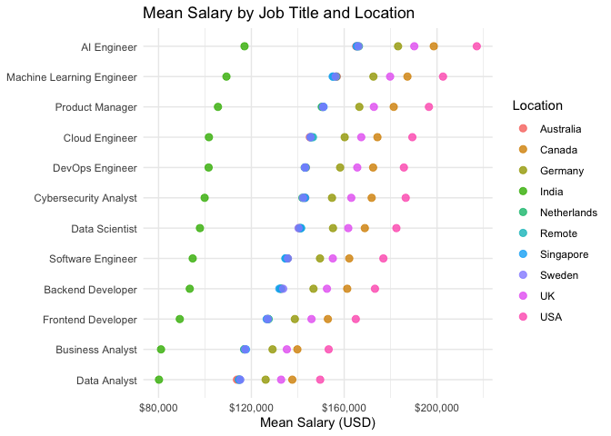<!-- -->

The dot plot confirms that AI Engineer and Machine Learning Engineer
consistently earn the most across almost all locations, while Data
Analyst and Business Analyst remain at the bottom. The USA consistently
has the highest dots for every job title, while India has the lowest.
Notably, the gap between locations is visible across all roles meaning
the location premium holds regardless of job title. This confirms that
both job title and location independently influence salary, and their
effects stack.

## Conclusion.

In conclusion, our analysis of 250,000 global tech job records and
subsequent machine learning models have shed light on several important
drivers of salary in the technology industry. The most consistent
finding throughout our analysis was that salary is heavily influenced by
a small number of factors, while others — most notably industry — have
almost no impact at all.

Job title is the most intuitive salary driver, with AI and machine
learning roles commanding a premium of \$50,000 or more over traditional
analyst roles. Experience accumulates steadily and meaningfully,
contributing roughly \$54,000 across a 20-year career. Geography
introduces the starkest divide of all, with US-based workers earning
nearly double their Indian counterparts in the same roles. Company size
matters significantly, with Enterprise employers paying \$42,000 more
than Startups on average. Education contributes a more modest premium,
with PhD holders earning around \$32,000 more than High School
graduates. Skills and certifications are positively correlated with pay
but explain relatively little of the overall variance. And industry,
despite being a variable many job seekers consider carefully, turns out
to be essentially irrelevant within the tech sector.

In terms of prediction, XGBoost outperformed linear regression,
achieving an MAE of \$4,146 on the held-out test set. This means that
for most workers, the model can estimate annual salary within roughly
\$19,000, a useful tool for benchmarking, but still subject to the noise
introduced by factors not captured in the dataset, such as individual
negotiation, equity compensation, and company-specific pay bands.

Further research could explore interaction effects — for example,
whether the experience premium is larger for AI Engineers than for Data
Analysts — and whether the location effect is stable across all job
titles or concentrated in certain roles. Incorporating additional
variables such as programming language, years at current company, and
total compensation (including equity) would also improve the model’s
practical utility.
=======
- R
- tidyverse
- ggplot2
- caret
- xgboost
- Metrics
- Machine Learning
- Data Visualization
- R Markdown
>>>>>>> 4fa7f8199226caca4023112b51449e87eef8abac
